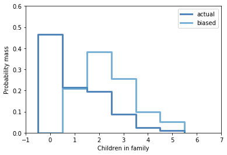

[Think Stats Chapter 3 Exercise 1](http://greenteapress.com/thinkstats2/html/thinkstats2004.html#toc31) (actual vs. biased)

Something like the class size paradox appears if you survey children and ask how many children are in their family. Families with many children are more likely to appear in your sample, and families with no children have no chance to be in the sample.
Use the NSFG respondent variable NUMKDHH to construct the actual distribution for the number of children under 18 in the household.

Now compute the biased distribution we would see if we surveyed the children and asked them how many children under 18 (including themselves) are in their household.

Plot the actual and biased distributions, and compute their means. As a starting place, you can use chap03ex.ipynb.

``` python
%matplotlib inline

import numpy as np

import nsfg
import thinkstats2
import thinkplot

resp = nsfg.ReadFemResp()

def BiasPmf(pmf, label):
    new_pmf = pmf.Copy(label=label)
    for x, p in pmf.Items():
        new_pmf.Mult(x, x)
    new_pmf.Normalize()
    return new_pmf

pmf_actual = thinkstats2.Pmf(resp['numkdhh'], label='actual')
pmf_biased = BiasPmf(pmf_actual, label='biased')

thinkplot.PrePlot(2)
thinkplot.Pmfs([pmf_actual, pmf_biased])
thinkplot.Show(xlabel='Children in family',ylabel='Probability mass',axis=[-1, 7, 0, 0.6])

print('Actual distribution mean: %f' % pmf_actual.Mean())
print('Biased distribution mean: %f' % pmf_biased.Mean())
print('Biased mean - actual mean: %f' % (pmf_biased.Mean() - pmf_actual.Mean()))
```




Actual distribution mean: 1.024205

Biased distribution mean: 2.403679

Biased mean - actual mean: 1.379474
