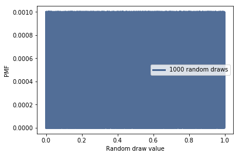
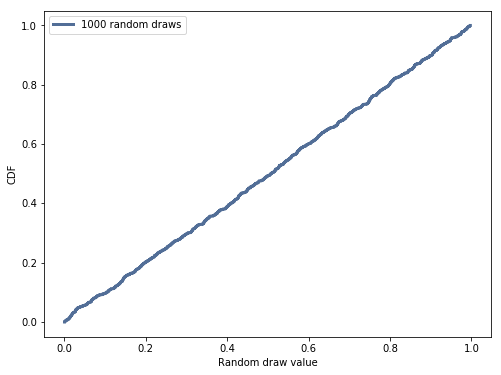

[Think Stats Chapter 4 Exercise 2](http://greenteapress.com/thinkstats2/html/thinkstats2005.html#toc41) (a random distribution)

The numbers generated by random.random are supposed to be uniform between 0 and 1; that is, every value in the range should have the same probability.

Generate 1000 numbers from random.random and plot their PMF and CDF. Is the distribution uniform?


```python

import numpy as np
np.random.seed(1)

import thinkstats2
import thinkplot

rand_1000 = np.random.random(1000)
rand_pmf = thinkstats2.Pmf(rand_1000, label='1000 random draws')
rand_cdf = thinkstats2.Cdf(rand_1000, label='1000 random draws')

thinkplot.Pmf(rand_pmf)
thinkplot.Show(xlabel='Random draw value', ylabel='PMF')

thinkplot.Cdf(rand_cdf)
thinkplot.Show(xlabel='Random draw value', ylabel='CDF')

```



